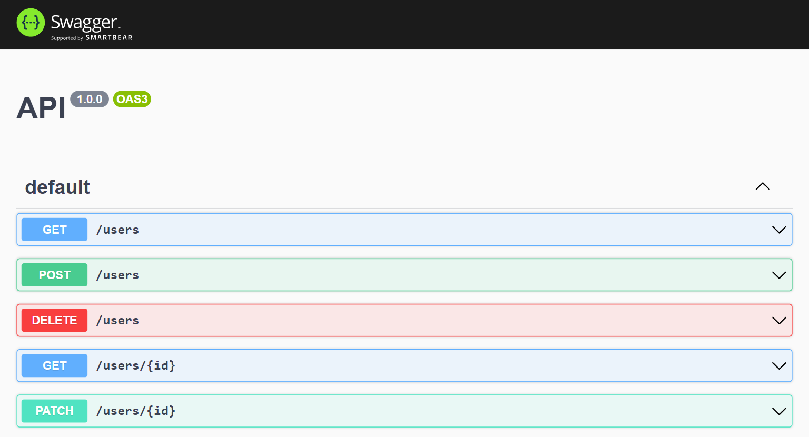
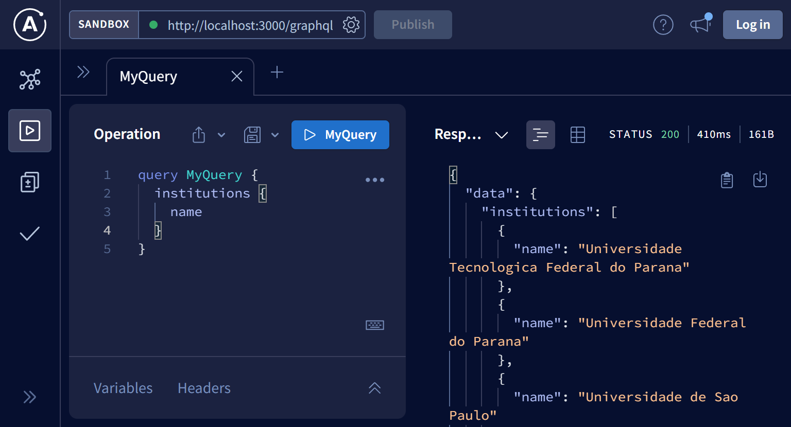
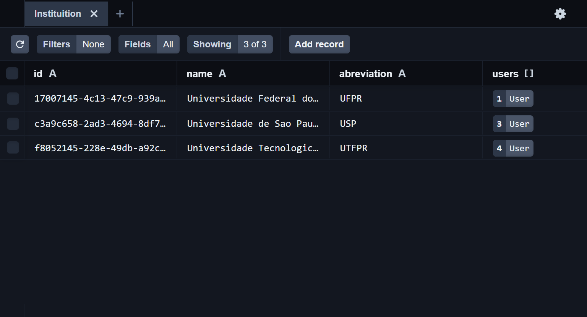

<p align="center">
    
</p>

    
<h3 align="center">Study Nest.JS with Prisma and GraphQL</h3>
  
<p align="center">
This project is mainly for study purposes. Explored how Nest.JS can be used as a back-end framework along with Apollo + GraphQL, Prisma, Swagger native support.
</p>

---

<p align="center">
 <a href="#getting_started">Getting started</a> •
 <a href="#built_using">Technologies</a> •
 <a href="#authors">Authors</a>
</p>

---

## 🏁 Getting Started <a name = "getting_started"></a>

### 🎐 Prerequisites

1. Install `node >= 12`

### ✨ Installing

1. Clone this repository or install all the files
2. Run `pnpm i`
3. Run locally with `pnpm dev`

### 🏁 Run
1. Visit swagger page at `https://localhost:3000/api` to see all the endpoints available and test them out with REST.



2. Visit apollo graphql playground at `https://localhost:3000/graphql` to play around with graphql and send queries and mutations



3. Visit prisma studio page at `https://localhost:5555` to an interactive database explorer



## 🏭 Structure

```
app
├── .github
│     ^ Folder to github readme assets
├── prisma
│   │ ^ Folder to prisma
│   ├── migrations
│   │    ^ History of database migrations
│   ├── dev.db
│   │    ^ SQLite Database
│   └── schema.prisma
│        ^ All database models and your relations defined
├── src
│   ├── modules
│   │   ├── institutions
│   │   │   ├── dto
│   │   │   │   │ ^ Data transfer object
│   │   │   │   └── ...
│   │   │   ├── institutions.controller.ts
│   │   │   │    ^ Responsible to handle REST requests
│   │   │   ├── institutions.graphql
│   │   │   │    ^ Define queries and mutations to expose
│   │   │   ├── institutions.module.ts
│   │   │   │    ^ Responsible to bundle all logic and optimize
│   │   │   ├── institutions.resolver.ts
│   │   │   │    ^ Responsible to handle GraphQL requests
│   │   │   └── institutions.service.ts
│   │   │        ^ Responsible to handle tasks and perform actions
│   │   └── ...
│   └── services
│       ├── PrismaService
│       │   └── Prisma.service.ts
│       │        ^ Injectable service responsible to connect to prisma client
│       └── ...
├── test < Nest.JS support for E2E tests
│   ├── jest-e2e.json
│   │    ^ Jest configuration
│   └── ...
├── .editorconfig
│    ^ Editor configurations
├── .env.template
│    ^ Template for enviroment variables
├── .eslintignore
│    ^ ESLint ignore files
├── .eslintrc.js
│    ^ File to ESLint configurations
├── .gitignore
│    ^ File to git ignore files
├── .prettierignore
│    ^ File to Prettier ignore files
├── .prettierrc
│    ^ File to Prettier configurations
├── LICENSE.md
│    ^ MIT License
├── nest-cli.json
│    ^ Nest.JS CLI configuration
├── package.json 
├── pnpm-lock.yaml
│    ^ Pnpm lock file
├── README.md 
├── tsconfig.build.json
│    ^ Typescript configuration
└── tsconfig.json
     ^ Nest.JS provides a default tsconfig.json file
```

## ⚙ Built with <a name = "built_using"></a>


## ✍️ Authors <a name = "authors"></a>
- [@Hiyudev](https://github.com/Hiyudev)

## © License
- MIT License